# PAIRPLAY

1. 사용한 JVM, 웹서버, WAS 제품 등의 종류와 설정값, 버전 기재
2. 빌드 시 사용되는 환경 변수 등의 주요 내용 상세 기재
3. 배포 시 특이사항 기재
4. DB 접속 정보 등 프로젝트(ERD)에 활용되는 주요 계정 및 프로퍼티가 정의된 파일 목록

---

### 1. 사용한 JVM, 웹서버, WAS 제품 등의 종류와 설정값, 버전 기재

### IDE

- VSCode

### Frontend

| Name       | Version        |
| ---------- | -------------- |
| Vue        | @vue/cli 5.0.4 |
| Javascript | ES6이상        |
| Node       | V16.13.2       |
| Nginx      | nginx-1.21.6   |

### Backend

| Name | Version |
| ---- | ------- |
|      |         |
|      |         |
|      |         |
|      |         |


### Server

| Name    | Version                                |
| ------- | -------------------------------------- |
| Docker  | Docker version 20.10.12, build e91ed57 |
| Jenkins | jenkins/jenkins:lts 이미지 사용        |
|         |                                        |
|         |                                        |


### DevOps

- NginX
- Jenkins
- Docker

### 협업 툴

- Gitlab
- Notion
- Jira
- Mattermost
- Webex
- Mindmeister
- Figma
- ERD Cloud
- Google Docs
- MobaXterm (Ubuntu 환경)
- MySQL Workbench

### 2. 빌드 시 사용되는 환경 변수 등의 주요 내용 상세 기재

```markdown
사용중인 포트

8088 -> 백엔드
80, 443 -> 프론트엔드
9090, 8080 -> 젠킨스
3333, 27017 -> mongoDB
3663 -> MySQL
```


```python
# /frontend/Dockerfile


FROM node:16 as build-stage

# 도커 컨테이너 내부 작업 디렉터리를 /app으로 지정
WORKDIR /app

# /front 내부 모든 파일을 {container}/app으로 이동
ADD . .

# 옮긴 파일들을 빌드
RUN npm install
RUN npm run build

# Nginx =========================

FROM nginx:stable-alpine as production-stage

# front/nginx/nginx.conf 파일을 도커 컨테이너 내부로 이동
# -> /etc/nginx/conf.d/default.conf로 이동
COPY  ./nginx/nginx.conf /etc/nginx/conf.d/default.conf

# /app 은 위에서 지정한 workdir 바로 아래 생긴 파일을 nginx로 웹 서버 구동.
COPY --from=build-stage /app/dist /usr/share/nginx/html
CMD ["nginx", "-g", "daemon off;"]
```

```python
# /frontend/nginx/nginx.conf

server {
  listen 80;
  listen [::]:80;

    # server_name 도메인;
  server_name pairplay.site;

  access_log /var/log/nginx/access.log;
  error_log /var/log/nginx/error.log;

  location / {
    alias /usr/share/nginx/html;
    try_files $uri $uri/ /index.html;
    return 301 https://$server_name$request_uri;
  }
}

server {
    listen 443 ssl;
    listen [::]:443 ssl;

    # server_name 도메인;
    server_name pairplay.site;

    ssl_certificate /var/www/html/fullchain.pem;
    ssl_certificate_key /var/www/html/privkey.pem;

    root /usr/share/nginx/html;
    index index.html;

    location / {
        try_files $uri $uri/ /index.html;
    }

    location /api {
        proxy_pass https://pairplay.site:8088/api;
    }

    location /oauth2 {
        proxy_pass https://pairplay.site:8088/oauth2;
    }

    location /swagger-ui {
        return https://pairplay.site:8088/swagger-ui/index.html;
    }

    location /jenkins {
        return http://pairplay.site:9090/;
    }
}

```

```python
# /backend/Dockerfile

FROM openjdk:8-jdk-alpine
ARG JAR_FILE=build/libs/*.jar
COPY ${JAR_FILE} app.jar
ENTRYPOINT ["java","-jar","/app.jar","--spring.config.name=application-prod"]
```

### 3. 배포방법

#### 	3-1. 배포 전 기본 설정

```markdown
배포는 Docker를 사용하기 때문에 담당자가 Docker Hub에 가입해서 Repository를 만들어야한다.
그 다음 docker desktop을 설치하고 로그인을 해야 도커 빌드/푸쉬가 가능하다.
VS Code에서 Docker를 설치하는 과정은 생략.

MobaXterm을 사용한 EC2서버 설정방법//
새로운 세션을 등록해서 ubuntu로 로그인하는 것까지 성공했다면, 기본적으로 /home/ubuntu/로 파일 경로가 설정되어있을 것이다.
```

#### 	3-2. SSL 인증서 발급 및 인증서 이동

```bash
# 인증서 보관 폴더를 미리 생성해야한다.
sudo mkdir /home/ubuntu/docker-volume
sudo mkdir /home/ubuntu/docker-volume/ssl
# 또는 좌측 폴더구조 탭에서 우클릭 해서 직접 만들어도 된다.

# letsencrypt 설치하기
sudo apt-get update
sudo apt-get install letsencrypt

# 인증서 발급
# sudo letsencrypt certonly --standalone -d 도메인[팀ID.p.ssafy.io]
sudo letsencrypt certonly --standalone -d k6e205.p.ssafy.io

# 이메일 입력 및 안내 사항에 동의 후 진행

# root 계정 로그인 - 크리티컬한 항목도 진행해버릴 수 있기 때문에 자주 사용하지 않는 것이 좋다.
sudo su

# 인증서 위치 폴더 이동
cd /etc/letsencrypt/live/도메인

# pem을 PKCS12 형식으로 변경
# key 파일 비밀번호 입력
openssl pkcs12 -export -in fullchain.pem -inkey privkey.pem -out key.p12 -name airpageserver -CAfile chain.pem -caname root

# 인증서 복사
sudo cp fullchain.pem /home/ubuntu/docker-volume/ssl
sudo cp privkey.pem /home/ubuntu/docker-volume/ssl
sudo cp key.p12 /home/ubuntu/docker-volume/ssl
```

#### 	3-3. 도커 및 젠킨스 설치

- 필수 패키지 설치

```bash
sudo apt-get install apt-transport-https ca-certificates curl gnupg-agent software-properties-common
```

- GPG Key 인증

```bash
curl -fsSL <https://download.docker.com/linux/ubuntu/gpg> | sudo apt-key add -
```

- docker repository 등록

```bash
sudo add-apt-repository \\
"deb [arch=amd64] <https://download.docker.com/linux/ubuntu> \\
$(lsb_release -cs) \\
stable"
```

- docker 설치

```bash
sudo apt-get update && sudo apt-get install docker-ce docker-ce-cli containerd.io
```

- docker 설치 확인

```bash
docker -v
```

- 젠킨스 설치

```bash
sudo docker run -d --name jenkins -u root --privileged \
-p '9090:8080' \
-v '/home/ubuntu/docker-volume/jenkins:/var/jenkins_home' \
-v '/var/run/docker.sock:/var/run/docker.sock' \
-v '/usr/bin/docker:/usr/bin/docker' \
jenkins/jenkins:lts


# 참고로 마지막 줄에서 원래는 jenkins/jenkins를 사용하는 것이 최신 버전이지만, 안정성 측면에서 :lts 태그를 붙인 버전을 사용하는 것을 추천한다.
```

#### 	Jenkins 환경설정

#### 

``` bash
1. `도메인:9090` 접속 -> 위에서 포트를 9090을 열어주었기 때문. 다른 포트를 열어주었다면 다른 포트로 접속
	ex) http://k6e205.p.ssafy.io:9090

2. 젠킨스 창 확인

3. `sudo docker logs jenkins` 명령어 입력 → 위 사진처럼 나오는 root 계정 비밀번호 확인 후 웹 젠킨스에 입력

4. `Install suggested plugins` 선택

5. 계정 생성
```

#### 	3-4. 배포

```markdown
젠킨스를 통한 CI/CD가 이루어지고 있지만 백엔드와 프론트엔드를 따로 관리하고있으므로 각 브랜치에 변경사항이 생겼을 경우 직접 배포를 해줄 필요는 없지만
수동적으로 배포를 위해서는
backend/
frontend/
두 위치에서 따로 빌드한 도커이미지를 도커 허브에 푸쉬 후 EC2에서 도커이미지를 내려받고 실행해줘야 한다.
아래에서 소괄호는 모두 사용자가 수정해야 하는 부분을 의미한다.


빌드방법:
Dockerfile과 같은 위치에서

로컬 터미널//

1.  docker build -t (dockerhub명)/(사용할이미지 명 (레포지토리 명)):(사용할버전태그) .
	ex) docker build -t user/pairplayfront:0.0.1 .

이미지 명과 버전 태그는 항상 임의로 설정하면 된다. 도커 허브에 만들어놓은 레포지토리에 따라 이미지명은 그대로 두고, 버전 태그만 바꾸어서 빌드한다.
태그를 항상 바꿔주는 것이 귀찮다면 버전 태그를 입력하지 않고 latest를 활용해도 된다.
마지막 . 은 해당 위치에서 빌드한다는 뜻이므로 만약 도커파일보다 상단의 위치에서 진행한다면 ./frontend 와 같이 작성할 수 있다.

2.  docker push (dockerhub명)/(사용할이미지 명 (레포지토리 명)):(사용할버전태그)

여기서 이미지 명과 버전 태그는 위에서 빌드한 그대로 사용해야 한다. 아니면 다른 이미지가 도커 허브에 올라갈 수 있다.

EC2 환경//
3. sudo docker pull (dockerhub명)/(사용할이미지 명 (레포지토리 명)):(사용할버전태그)

로컬에서 빌드하여 푸쉬한 이미지를 EC2에서 내려받는다.

4.  (프론트엔드 이미지 런)
    sudo docker run -d --rm --name (이 이미지를 설정할 이름) -p 80:80 -p 443:443 -v /home/ubuntu/docker-volume/ssl:/var/www/html 		(dockerhub명)/(사용할이미지명):(사용할버전태그)
    
    (백엔드 이미지 런)
    sudo docker run -d --rm --name (이 이미지를 설정할 이름) -p 8000:8000 -v /home/ubuntu/docker-volume/ssl:/root 					(dockerhub명)/(사용할이미지 명 (레포지토리 명)):(사용할버전태그)

내려받은 도커 이미지를 실행한다. 

-d 		: 백그라운드에서 실행하라는 것을 의미하는데 해당 태그를 사용하지 않으면 EC2 콘솔창이 잡아먹히므로 백그라운드에서 실행하도록 하자.
--rm 	: 이 이미지가 실행하는 상태가 아니게 되면(사용자가 정지시키거나 에러가 발생하여 실행이 정지되었을 경우), 이 이미지를 삭제한다. 사용하지않는 이미			 지들이 남아있을 경우 용량을 잡아먹기 때문에 문제없는 것이 확실한 이미지라면 --rm을 사용해도 되지만, 에러가 발생할지도 모르는 경우에는 실행이 			 정지되고나서 어떤 에러가 발생했는지 로그를 볼 수 없기때문에 해당 태그를 사용하지 않는 것을 추천한다.
--name 	: 이 이미지를 부를 이름을 설정하는 태그. 해당 항목을 설정해주지 않으면 기본적으로 임의의 이름이 생성된다. 그러면 나중에 이 이미지를 찾아서 중지			  시키고 삭제하는 과정이 꽤 번거롭기 때문에 붙여주는 것이 좋다.
-p		: 이 이미지가 사용할 포트번호를 지정해주는 태그. 0000:1111의 경우 0000포트로 입력이 들어오면 1111포트로 보내준다.
-v		: 이 이미지의 볼륨을 설정해주는 태그. 왼쪽과 오른쪽을 이어주기 때문에 오른쪽으로 들어온 입력을 왼쪽에서 찾아볼 수 있다. 여기서 볼륨은 보통 SSL		  을 사용하기위해 사용되었다.
```


#### 	3-5. 젠킨스 설정 및 자동배포

- Jenkins 관리 - 플러그인 관리


- Gitlab 플러그인 설치


- 새로운 아이템 - 파이프라인

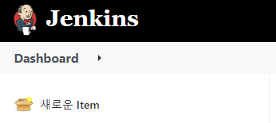

- 이름 설정 - OK


- 설정

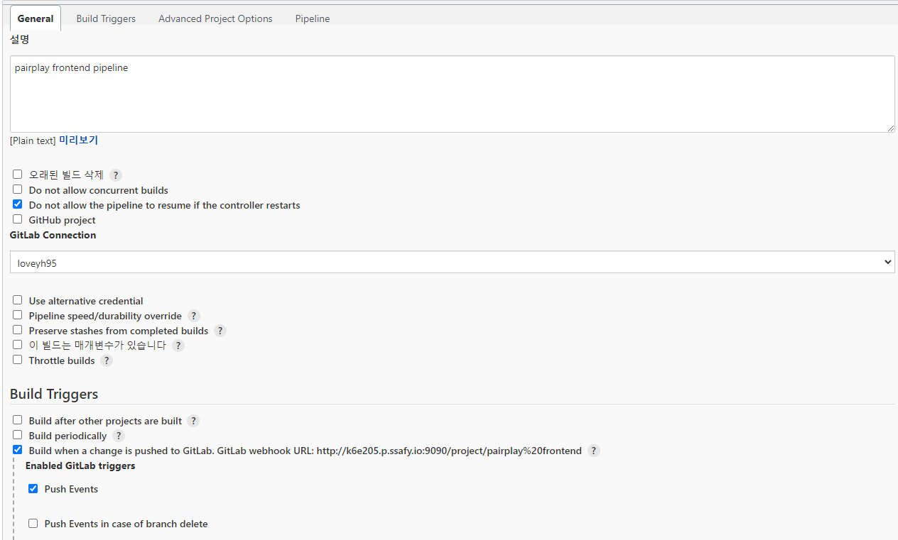

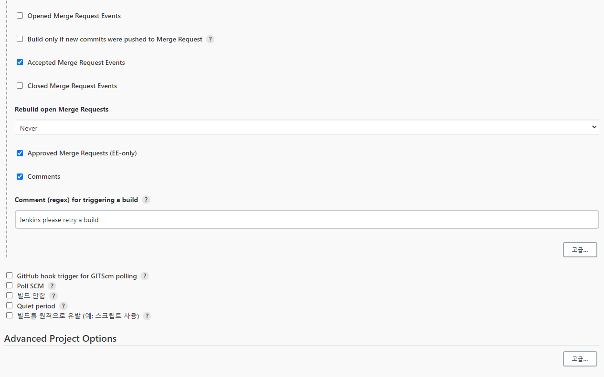

- Advanced Project Options - 고급 클릭

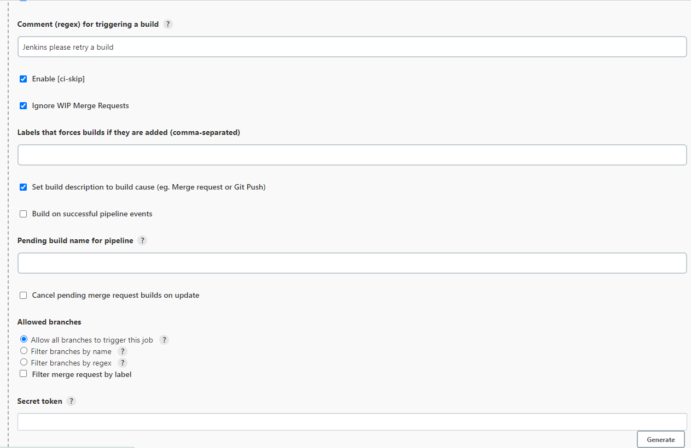

- 하단 Secret token이 빈 상태에서 Generate 클릭하여 생성된 token 복사
- Gitlab 프로젝트 - Settings - Webhooks


- 해당하는 URL과 아까 복사해둔 token값 입력 후 


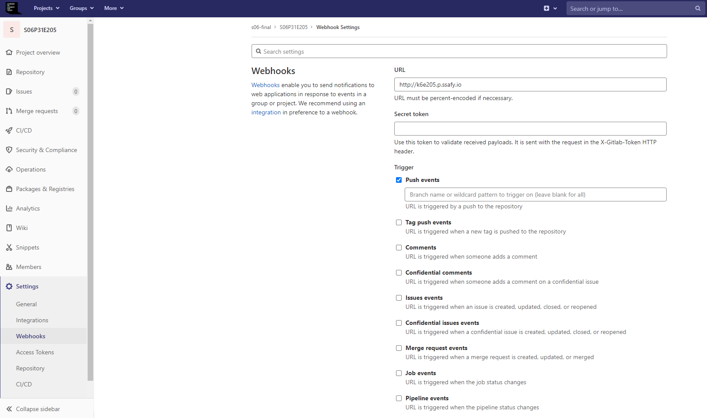

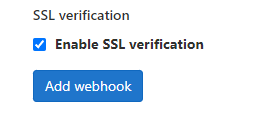

- Add webhook 클릭
- 하단에 생성된 새로운 웹훅 Test - Push events 클릭

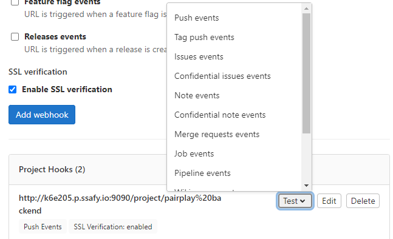

- 상단에 HTTP 200 코드가 떴다면 성공


- 파이프라인 설정은 잠시 저장해두고 젠킨스홈 - Jenkins 관리 - Manage Credentials 클릭

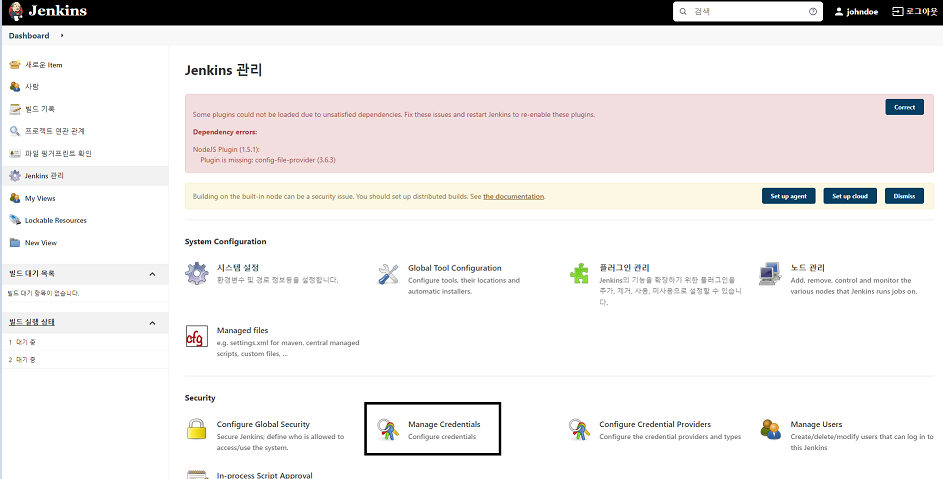

- add credentials


- 깃랩 아이디, 패스워드입력 + 젠킨스에서 사용할 ID 설정 후 OK

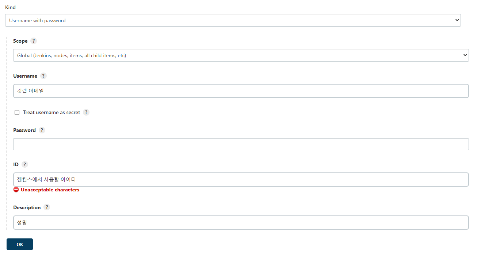

- 다시 젠킨스 홈 - 설정하던 Pipe line 클릭 - 구성 - GitLab Connection 아이디 선택


- Pipeline 스크립트 작성


#### // frontend

```bash
node {
    stage ('clone') {
        git branch: 'frontend', credentialsId: '젠킨스에서 사용할 credentials 아이디', url: '깃랩 레포지토리 주소'
    }
    dir('frontend'){
        stage ('docker build') {
            echo 'start build'
          sh "docker build -t (dockerhub명)/(사용할이미지 명 (레포지토리 명)):(사용할버전태그) ."
        }
        
        stage ('docker run') {
            echo 'start run'
            sh 'docker ps -q --filter name=pairplayfront | docker stop pairplayfront && docker rm pairplayfront'
            sh 'docker run -d --name pairplayfront -p 80:80 -p 443:443 -v /home/ubuntu/docker-volume/ssl:/var/www/html (dockerhub명)/(사용할이미지 명 (레포지토리 명)):(사용할버전태그)'
        }
        
        stage('Finish') {
            sh 'docker images -qf dangling=true | xargs -I{} docker rmi {}'
        }
    }
}
```


#### //backend

```bash
node {
    stage ('clone') {
        git branch: 'backend', credentialsId: '젠킨스에서 사용할 credentials 아이디', url: '깃랩 레포지토리 주소'
    }
    dir('backend'){
        stage ('gradle build') {
            echo 'start gradle build'
            sh "chmod +x gradlew"
            sh "./gradlew build"
        }
        
        stage ('docker build') {
            echo 'start build'
          sh "docker build -t (dockerhub명)/(사용할이미지 명 (레포지토리 명)):(사용할버전태그) ."
        }
        
        stage ('docker run') {
            echo 'start run'
            sh 'docker ps -q --filter name=pairplayback | docker stop pairplayback && docker rm pairplayback'
            sh 'docker run -d --name pairplayback -p 8088:8088 -v /home/ubuntu/docker-volume/ssl:/root (dockerhub명)/(사용할이미지 명 (레포지토리 명)):(사용할버전태그)'
            echo 'start rmi'
            // sh 'docker rmi $(docker images -f "dangling=true" -q)'
        }
        
        stage('Finish') {
            sh 'docker images -qf dangling=true | xargs -I{} docker rmi {}'
        }
    }
}
```


- 젠킨스 홈 - Jenkins 관리 - 시스템 설정 Gitlab 관련 설정(깃랩 토큰을 받아와서 사용)

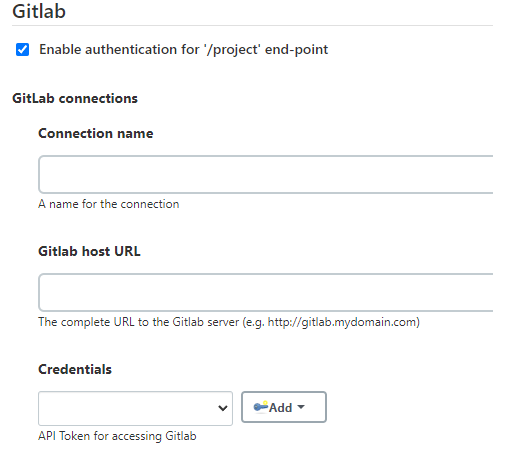

- 깃랩 해당하는 브랜치에 푸쉬/머지로 테스트 해보기.


// 추가 편의사항


1. 머지 또는 변화가 생겼을 경우 MM과 연결하여 빌드 시작과 오류/완료를 메세지로 받아볼 수 있도록 하였음.

   -> Try - catch 문을 사용했기 때문에 오류에 대응할 수 있도록 하였다.

   ​	중간에 오류가 발생하여도 docker run은 정상작동할 수 있는지 테스트 해보기 위해 finally를 사용하였다.


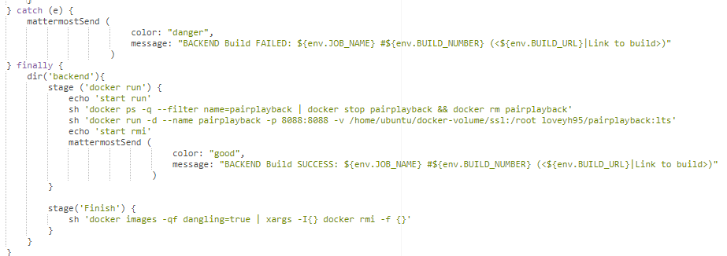


### 4. DB 접속 정보 등 프로젝트(ERD)에 활용되는 주요 계정 및 프로퍼티가 정의된 파일 목록

- 접속 정보

- erd

